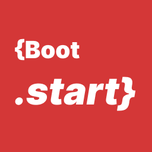

<p align="center">
  
</p>

<h1 align="center">Start (.start)</h1>

Welcome to the **Start** VSCode extension! This extension is designed to simplify your development workflow by automatically running commands from a `.start` file located in your project's root folder whenever you open VSCode.

## Features

- **Automatic Command Execution**: This extension automatically creates new terminals and runs commands specified in a `.start` file as soon as VSCode is fully opened.
- **Multiple Commands**: Supports running multiple commands separated by commas, each in a new terminal.
- **Easy Setup**: Easily set up and start your project without manually executing repetitive commands.

## Installation

1. Open the **VSCode Extension Marketplace** by pressing `Ctrl+Shift+P` (Windows/Linux) or `Cmd+Shift+P` (Mac).
2. Search for "**Start**" and click the "Install" button.
3. After installation, the extension will be ready to use.

## Usage

1. **Create a `.start` File**: In the root folder of your project, create a `.start` file (or multiple `.startYourProjectName` files if preferred).
2. **Add Commands**: Inside the `.start` or `.startYourProjectName` files, list the commands you want to run. Prefix each command line with `\t` to signify a new terminal. For example:
   ```bash
   \t cd server, source venv/bin/activate, python app.py
3. **Start Projects**: Open your project in VSCode. The extension will automatically detect the `.start` file and execute the commands when VSCode finishes loading.

## Command Syntax

- **`\d`**: If a file have first line `\d`, the commands on this file will be marked as default. These commands will be executed automatically as soon as VSCode fully opens.
- **`\c`**: Lines starting with `\c` are comments and will be ignored.
- **`\t`**: Lines starting with `\t` signify commands to be run in a new terminal. You can separate multiple commands with commas.

## Example `.start` File

```bash
\t python -m venv venv
\t source venv/bin/activate, pip install -r requirements.txt
\t python app.py
```
In this example, each command will run in its own terminal, starting with setting up a Python virtual environment, installing dependencies, and finally running the application.

## Configuration

Currently, this extension does not support any configurable options.

## Feedback and Contributions

We welcome your feedback, suggestions, and contributions. Please visit our [GitHub repository](https://github.com/ashusharmadev/.start.git) to get involved.

## License

This extension is licensed under the MIT License.